# Operaciones matemáticas por medio de recursión

* Suma de dígitos de un número entero
* Invertir los dígitos de un número entero
* Creación de un arreglo de 100 posiciones de manera aleatoria
* Localización del número mayor del arreglo
* Localización del número menor del arreglo
* Cantidad de números pares del arreglo
* Cantidad de números impares del arreglo

## Especificaciones

* Aplicación creada en el lenguaje Java
* Uso de Apache Netbeans 12.0
* OpenJDK 11.0.11
* Ubuntu MATE 20.04

### Capturas

**Menú principal (antiguo)**

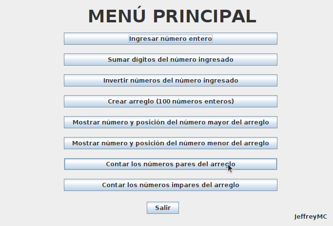

**Nuevo menú**

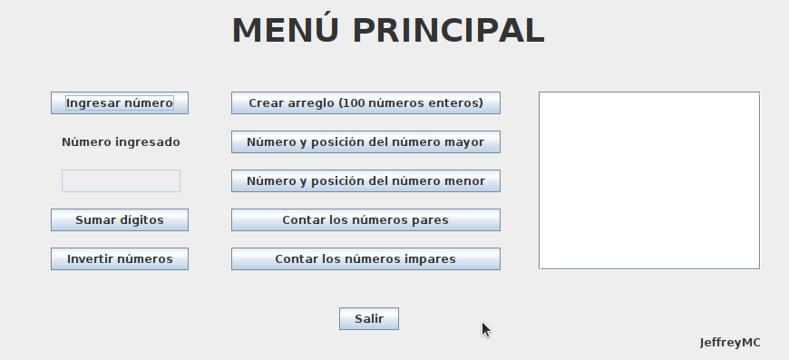

**Ingreso de número entero**

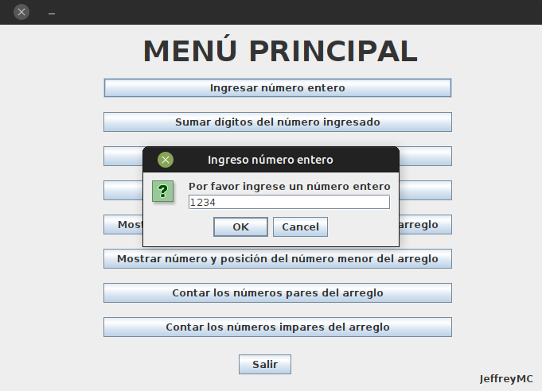

**Suma de dígitos**

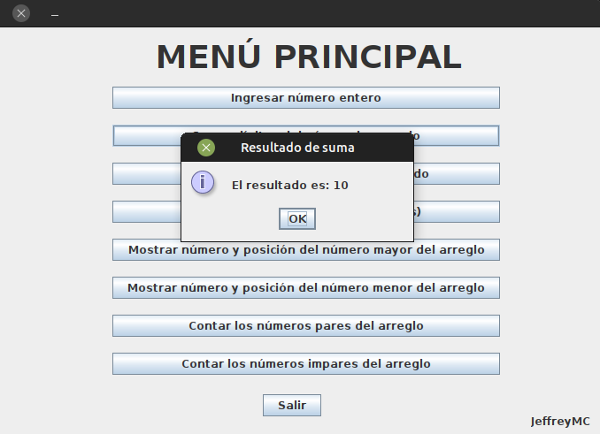

**Invertir dígitos**

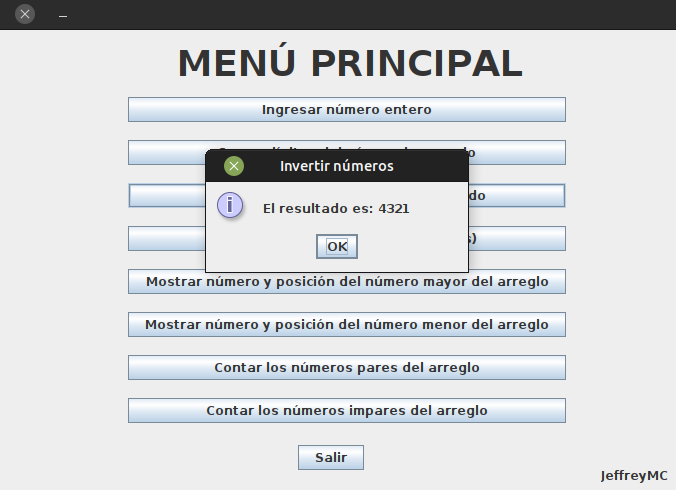

**Creación de arreglo**

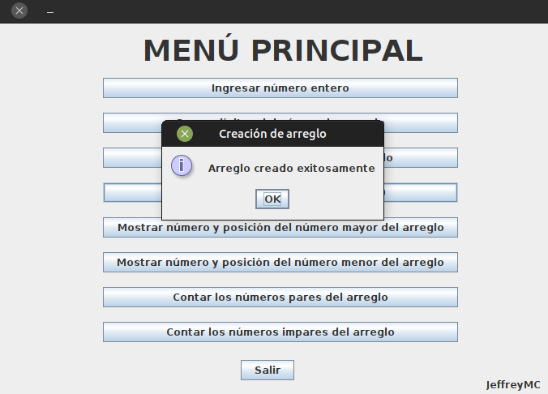

**Mostrar arreglo**

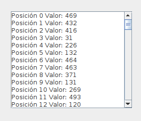

**Número mayor del arreglo**

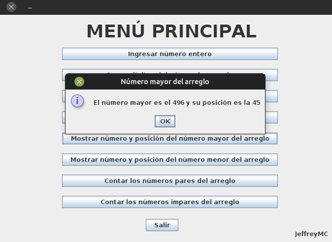

**Número menor del arreglo**

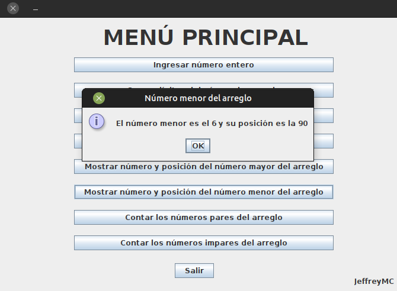

**Número menor del arreglo**

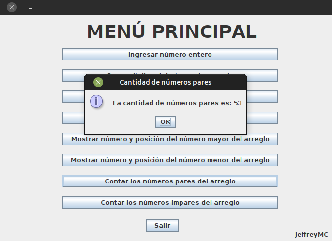

**Número menor del arreglo**

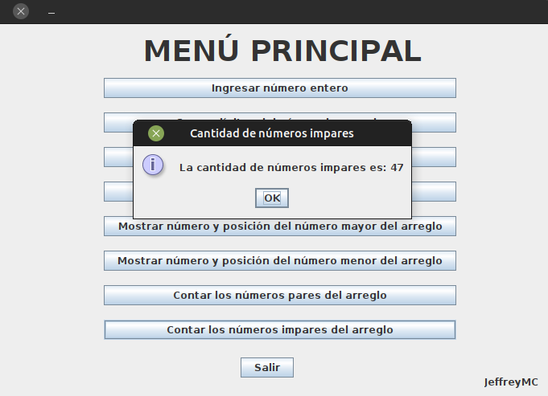